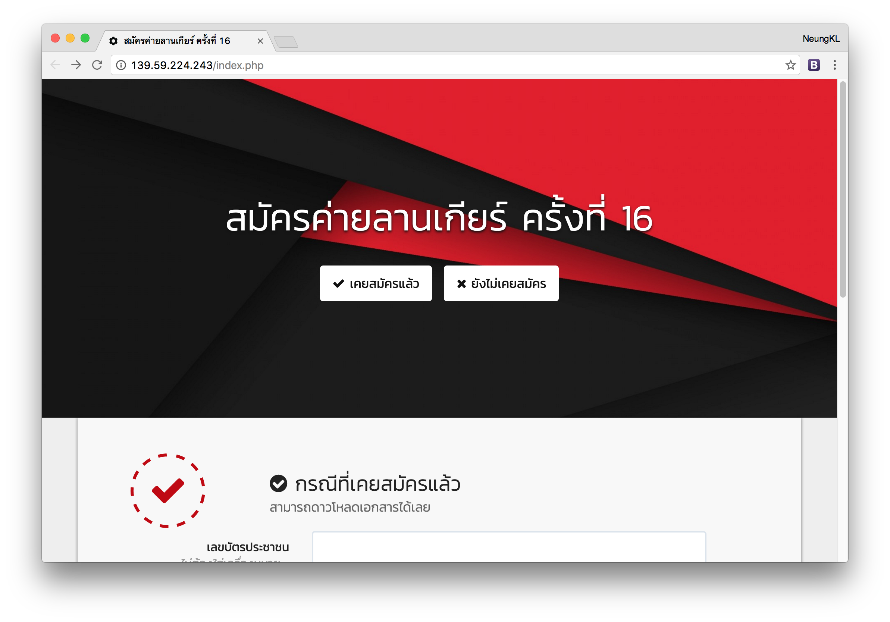

# Larngear Registration

16th Larngear Registration Website

## Features

- An easily public registration system for end-user
- Auto-generate ID code group by province and gender
- Auto-generate envelope cover using GD image library

## Installation

1. Set up `.env` variable. Change `.env.sample` to `.env`
2. `npm install && gulp`
3. `php composer.phar install`
4. Import database from `backup/Larngearregister.sql`
5. Please insert `A,B,C,D` types into table `Larngearregister.counter` (with zero count value), for example:

  | type  | count |
  | --- | --- |
  | A | 0 |
  | B | 0 |
  | C | 0 |
  | D | 0 |
6. Done

PS. you can also deploy via Heroku (`Procfile` available)

## License

[GNU GENERAL PUBLIC LICENSE 3.0 &copy; Kosate Limpongsa](LICENSE.md)
